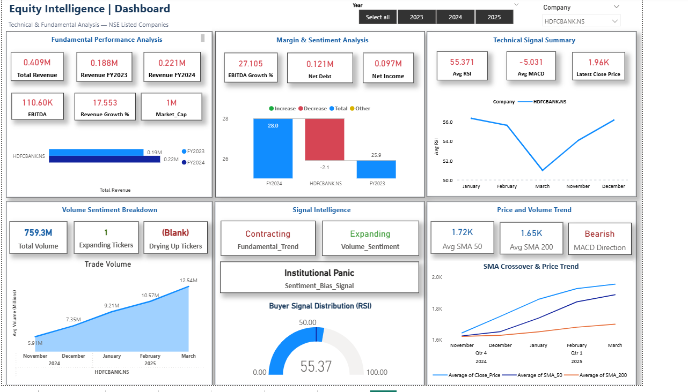
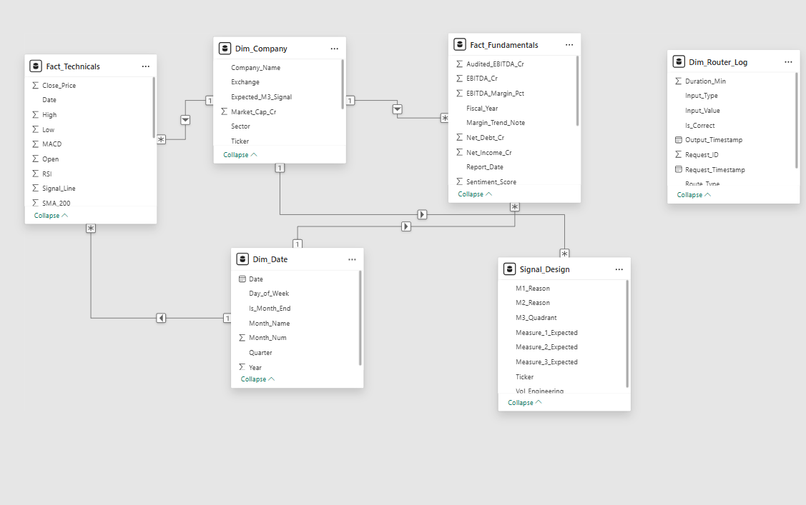

# 📊 Automated Investor Power BI Dashboard

## 🚀 Overview

Automated Investor Power BI Dashboard is an AI-powered financial analytics and visualization platform that combines:

- Real-time stock market data
- Technical indicators
- Large Language Models (LLMs)
- Fundamental analysis
- Interactive Power BI dashboards

The project automates financial intelligence extraction from annual reports and synthesizes it with live market signals to generate actionable investment insights.

---

# 🎯 Problem Statement

Financial firms and equity research teams face information overload while analyzing:

- Annual reports
- ESG filings
- Financial statements
- Market volatility
- Trading signals
- Market sentiment

This project bridges the gap between:

✅ Quantitative Market Data  
✅ Fundamental Financial Analysis  
✅ AI-driven Insight Extraction

The system combines technical market indicators with AI-extracted financial insights to help generate smarter investment intelligence.

---

# 🧠 Key Features

- 📈 Real-time stock market ingestion using `yfinance`
- 🤖 Gemini LLM integration for annual report analysis
- 📊 Power BI dashboard visualization
- 📉 Technical indicators:
  - RSI
  - MACD
  - SMA
  - Volume Analysis
- 🧾 Automated extraction of financial metrics from PDFs
- 🧠 Sentiment and signal intelligence engine
- ⭐ Star-schema data warehouse modeling
- ⚡ CSV-based caching layer
- 📂 Unified analytics pipeline

---

# 🏗️ System Architecture

## Path A — Quantitative Pipeline

```text
yfinance API
    ↓
OHLCV Market Data
    ↓
Technical Indicators
(RSI, MACD, SMA, Volume)
    ↓
Fact_Technicals.csv
```

---

## Path B — Fundamental Pipeline

```text
Annual Report PDF
    ↓
Gemini API
    ↓
Pydantic Validation
    ↓
Structured Financial Data
    ↓
Fact_Fundamentals.csv
```

---

## Unified Analytics Layer

Both pipelines are merged inside Power BI to generate:

- Sentiment Analysis
- Investment Signals
- Trend Analysis
- Technical Intelligence
- Financial Performance Insights

---

# 📊 Dashboard Capabilities

The dashboard provides:

- Revenue trend analysis
- EBITDA tracking
- Net income analysis
- Market sentiment analysis
- Volume intelligence
- RSI monitoring
- Technical signal tracking
- AI-powered investment insights
- SMA crossover analysis
- Price-volume trend visualization

---

# 🧩 Tech Stack

| Component | Technology |
|---|---|
| Programming Language | Python |
| Dashboarding | Power BI |
| Data Processing | Pandas |
| Market Data API | yfinance |
| AI/LLM | Google Gemini API |
| Schema Validation | Pydantic |
| Technical Indicators | pandas-ta |
| Notebook Environment | Google Colab |
| Storage | Google Drive |
| Visualization | Microsoft Power BI |

---

# ⭐ Data Architecture

This project follows a **Star Schema Architecture** for optimized analytical querying.

## Fact Tables

- `Fact_Technicals`
- `Fact_Fundamentals`

## Dimension Tables

- `Dim_Ticker`
- `Dim_Date`

This architecture enables scalable business intelligence reporting and dashboard optimization.

---

# 📸 Dashboard Preview

## Main Dashboard



---

## Architecture Diagram



---

## Signal Intelligence Matrix


---

# 📁 Project Structure

```text
Automated-Investor-PowerBI-Dashboard/
│
├── data/
│   ├── Fact_Fundamentals.csv
│   ├── Fact_Technicals.csv
│   └── Dim_Ticker.csv
│
├── notebooks/
│   └── AFIM_Block4.ipynb
│
├── dashboard/
│   └── Power_BI_Project_Final.pbix
│
├── report/
│   └── PowerBI-Project_Report.pdf
│
├── screenshots/
│   ├── dashboard-main.png
│   ├── architecture.png
│   └── signals.png
│
├── requirements.txt
├── README.md
├── LICENSE
└── .gitignore
```

---

# ⚙️ Installation

## Clone Repository

```bash
git clone https://github.com/YOUR_USERNAME/Automated-Investor-PowerBI-Dashboard.git
```

---

## Navigate to Project Directory

```bash
cd Automated-Investor-PowerBI-Dashboard
```

---

## Install Dependencies

```bash
pip install -r requirements.txt
```

---

# ▶️ Running the Project

## Step 1 — Open Jupyter Notebook

Launch Jupyter Notebook or Google Colab.

---

## Step 2 — Run Notebook

Run notebook cells sequentially to:

- Fetch market data
- Calculate technical indicators
- Extract financial insights using Gemini API
- Generate CSV outputs

---

## Step 3 — Open Power BI Dashboard

Open:

```text
dashboard/Power_BI_Project_Final.pbix
```

Refresh datasets to visualize updated insights.

---

# 📈 Technical Indicators Used

## RSI (Relative Strength Index)

Used to identify:

- Overbought conditions
- Oversold conditions
- Entry opportunities

---

## MACD (Moving Average Convergence Divergence)

Used for:

- Trend confirmation
- Momentum analysis
- Signal crossover detection

---

## SMA (Simple Moving Average)

Includes:

- SMA 50
- SMA 200

Used for long-term trend analysis and crossover signals.

---

## Volume Trend Analysis

Used to detect:

- Institutional accumulation
- Weak market participation
- Breakout probabilities

---

# 🤖 AI Integration

Google Gemini API is used for:

- Annual report parsing
- Financial metric extraction
- Structured JSON generation
- Financial intelligence synthesis
- Sentiment interpretation

Pydantic validation ensures reliable schema-constrained outputs and reduces hallucination risks.

---

# 📊 Key Business Insights Generated

The dashboard identifies:

- Hidden accumulation opportunities
- Institutional panic signals
- Volume-price divergence
- Sentiment traps
- Breakout probabilities
- Margin expansion trends
- Market agreement signals

---

# 💡 Example Insights

## Strong Buy Signals

- Expanding EBITDA margins
- Increasing market volume
- Positive SMA crossover trends

---

## Sentiment Trap Detection

Cases where:

- Fundamentals improve
- Market volume remains weak

This indicates possible institutional accumulation before price breakout.

---

# 🔮 Future Enhancements

- Real-time streaming dashboard
- Azure cloud deployment
- Automated report scheduling
- Multi-market support
- Portfolio optimization engine
- ML-based stock prediction models
- API-based dashboard refresh
- Live trading signal alerts

---

# 📚 Learning Outcomes

This project demonstrates practical implementation of:

- Data Visualization
- Financial Analytics
- AI Integration
- ETL Pipelines
- Dashboard Engineering
- Business Intelligence
- Data Warehousing
- Star Schema Modeling
- Technical Market Analysis

---

# 👨‍💻 Contributors

- Jayasuriya P
- Vijay J
- A Atul
- Ayushi Aggarwal
- Avatansh Pandey

---

# 📄 Academic Context

This project was developed as part of:

**Data Visualization, Ethics and Privacy: MPBA G511**  
Birla Institute of Technology and Science, Pilani

---

# 📜 License

This project is developed for academic and educational purposes.

---

# ⭐ Support

If you liked this project:

⭐ Star the repository  
🍴 Fork the repository  
📢 Share your feedback

---

# 📬 Contact

For collaboration or queries:

- Create an issue in the repository
- Connect via GitHub

---

# 🚀 Final Note

This project combines:

```text
AI + Finance + Power BI + Python + ETL + Data Visualization
```

to build an intelligent financial analytics ecosystem capable of generating actionable investment insights from both structured and unstructured financial data.
